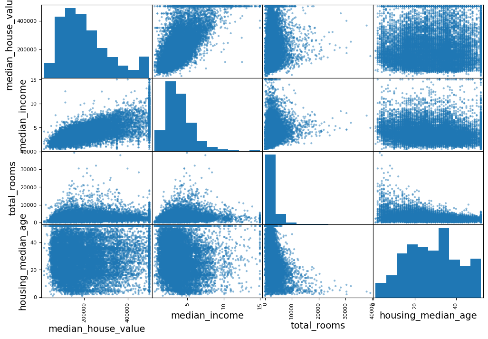
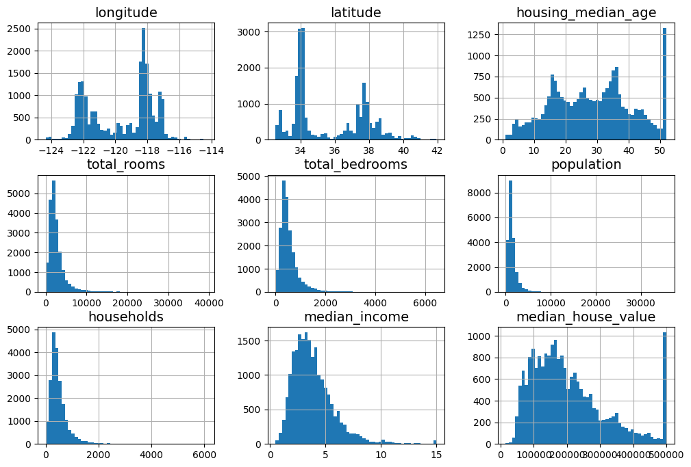
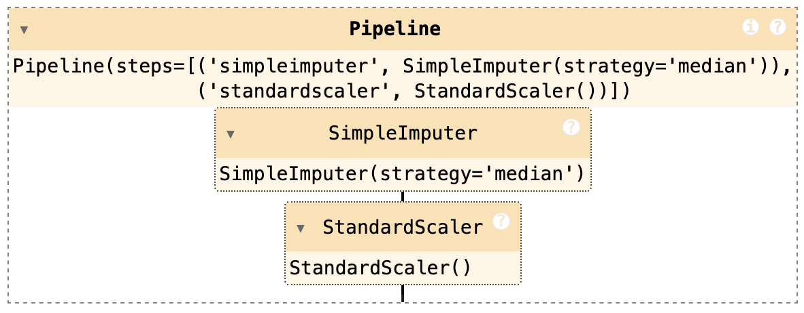
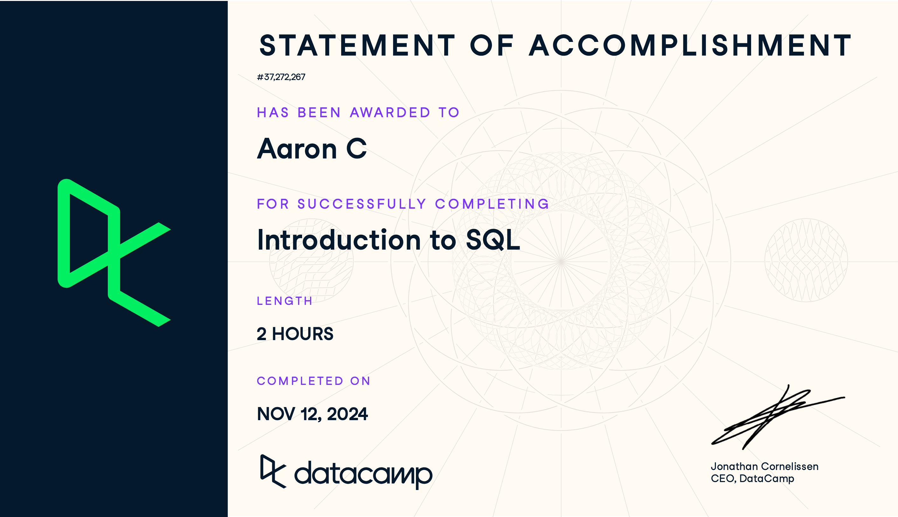
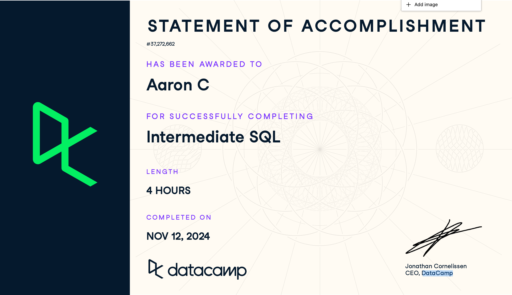

# Project 1A 2024-2025 Challenge Projects <!-- omit from toc -->

Aaron Ciuffo (245484)

This report contains a short summary of the tasks completed for Block A *Challenge Projects*. Through the course of this challenge period, I attempted the following challenges:

1. Audio Extraction and Machine Learning
2. Application of *Hands on Machine Learning with Scikit-learn, Keras & Tensor Flow*, Chapter 2
3. SQL Refresher

These challenges were selected because they are relevant to future work in the field of AI & Data Science, hold personal interest for me and align well with future course work. 


- [Documentation](#documentation)
- [Summary of Challenge Projects](#summary-of-challenge-projects)
  - [Time Accounting](#time-accounting)
- [Audio Extraction and Machine Learning](#audio-extraction-and-machine-learning)
  - [Project Scope](#project-scope)
  - [Problem Statement](#problem-statement)
  - [Technical Approach](#technical-approach)
  - [Challenges and Limitations](#challenges-and-limitations)
  - [Results](#results)
  - [Future Work](#future-work)
- [Application of *Hands-On Machine Learning with Scikit-Learn, Keras \& Tensor Flow*, Chapter 2](#application-of-hands-on-machine-learning-with-scikit-learn-keras--tensor-flow-chapter-2)
  - [Key Learning \& Outcomes](#key-learning--outcomes)
- [SQL Training](#sql-training)
  - [Introduction to SQL](#introduction-to-sql)
  - [Intermediate SQL](#intermediate-sql)
  - [Joining Data in SQL](#joining-data-in-sql)

## Documentation

- [Project Proposal](./README.md)
- [Project Journal](./Project_Journal.md)
- [*HOML* Exercise Workbook](./handson_exercises/)

## Summary of Challenge Projects

- [**Part 1 Audio Extraction and Machine Learning**](#audio-extraction-and-machine-learning): Create a first run at developing a ML algorithm to identify audio clips.
- [**Part 2: Explore *Hands-On Machine Learning***](#application-of-hands-on-machine-learning-with-scikit-learn-keras--tensor-flow-chapter-2): Work through the first several chapters to deepen my understanding with regards to challenges found in Part 1
- [**Part 3: SQL Training**](#sql-training): Take a break from ML and improve my understanding of SQL

### Time Accounting

**61.5 Total Hours | 10 Working Days | Daily Average Hours: 6.2**

|**Date** |**Hours** |**Status** |**Description** |**Notes** |
|--|--|--|--|--|
|11/3/2024 |5 |Completed |Test clustering via k-means and DBSCAN |K-means is about 80% effective, DBSCAN does not work particularly well |
|11/4/2024 |2 |Completed |Test clustering strategies using linkages |making progress |
|11/4/2024 |2 |Completed |compare clustering strategies |ward type linkages provides good matching for music & both, but not dialogue |
|11/4/2024 |3 |Completed |try to improve clustering using manually tagged samples |Improved clustering using random forest |
|11/4/2024 |1 |Completed |Document progress | |
|11/5/2024 |4 |Completed |Refine labeling and generate training data |Training sets are now much more accurate |
|11/5/2024 |3 |Completed |Combine various labeled sets for attempt at ensemble classification |Need to align the column values so they are consistent |
|11/6/2024 |2 |Completed |fix issues with combined data paths |Track down and fix issues accidental duplicates created through misues of pandas |
|11/6/2024 |1 |Completed |complete merge of all labeled data with features |This can now be used for ensemble training and testing there's a total of 412 labeled items that can be used for training purposes. |
|11/6/2024 |2 |Completed |build ensemble voting model |In testing, the model is > 97% accurate in classifying unlabeled tracks. |
|11/7/2024 |4 |Completed |moving on to try some of the activities in the HOML book |Ran into massive headache creating a [python environment](https://m.xkcd.com/1987/) to work in. Spent hours unwinding and understanding the problem. Yeesh.|
|11/7/2024 |3 |Completed |Untangled python environment, and wrote script to make it less awful to mange in the future. Maybe.|Here's a [new repo](https://github.com/txoof/pyenv_utilities) based on an old script that I overhauled to make creating pyenv/venv environments less awful.|
|11/7/2024 |1 |Completed |I did it. I have a working environment to try the exercises. |Phew. |
|11/7/2024 |2 |Completed |Started working through Hands-On Machine Learning |going to work through the first few chapters to see if I can gain some insight into different models and how they work |
|11/8/2024 |3 |Completed |Document progress and being final report |I've reached the goals I set out in the project overview. I'm going to try to extend my understanding |
|11/8/2024 |3 |Completed |Working on chapter 2 of HOML |completed initial EDA and segmenting data for training/testing |
|11/11/2024|2 |Completed |EDA in Chapter 2 of housing data |did a few more rounds of EDA, following the book. |
|11/11/2024|3 |Completed |Clean the data |impute some missing values and handle cadegorical values |
|11/11/2024|2 |Completed |Read and annotate rest of section: Feature Scaling and Transformation |read & annotated the book |
|11/12/2024|2 |Completed |Custom transformers |Studied the examples and get the gist. I'm not prepared to bust one of these out on my own yet. |
|11/12/2024|2 |Completed |Build Pipeline |Wow. The author's code is \*\*hard\*\* to follow. |
|11/12/2024|0.5 |Completed |Write feedback to author regarding code issues in ch2 |see [https://github.com/ageron/handson-ml3/issues/168](https://github.com/ageron/handson-ml3/issues/168) |
|11/12/2024| |Not started|Select and Train housing Model | |
| | |Not started|fine tune | |
| | |Not started|build ensemble? | |
| | |Not started|evaluate | |
|11/13/2024|4 |Completed |Taking a break from ML to do some SQL on Datacamp |completed 2 modules and started a third |
|11/13/2024|3 |Completed |Joining Data in SQL |a lot of new concepts here for me! This was great learning |
|11/15/2024|4 |Not started|Data Manipulation in SQL | |
|11/15/2024|2 |Completed |Write final report on progress | |


## Audio Extraction and Machine Learning

### Project Scope 
This project focused on leveraging existing machine learning techniques to build a system capable of identifying whether short audio tracks contain music. The ultimate goal is to support a larger system for identifying musical pieces featured in National Public Radio (NPR) broadcasts, addressing a significant gap in track identification for listeners.

### Problem Statement

NPR often uses music to conclude its segments but does not consistently provide details about the tracks used. This omission leaves many listeners unable to discover music they find engaging. A critical first step in addressing this challenge is accurately identifying audio segments that contain music. Given the costs associated with API-based music identification services, reducing unnecessary processing of non-music tracks is vital. This project developed a system to ensure only relevant tracks are sent for further identification, optimizing resources and reducing costs.

### Technical Approach 

#### Algorithms and Models

Initially, various clustering algorithms were explored to find patterns in unlabeled audio data with the hopes of labeling the tracks automatically, including:

- **k-Means**
- **t-SNE**
- **DBSCAN**
- **SciPy Hierarchical Clustering**

K-Means and Hierarchical Clustering were ultimately the best in revealing patterns in the data and grouping the tracks into three groups: Music, Music with Dialogue, Dialogue. Unfortunately the accuracy of [k-Means](./clustering_kmeans.ipynb) was only about 80% when validated manually. [DBSCAN](./clustering_DBSCAN.ipynb) proved to be not a good fit for the feature set of this data and no meaningful results were produced. The results from [t-SNE](./clustering_kmeans.ipynb) was interesting, but not conclusive enough to make use of.

Finally, the most useful tool for clustering data was using [Hierarchical Clustering](./clustering_HGCL.ipynb). This revealed the most useful groupings of the data and made for some great visualizations.


Ultimately, classification tasks used an ensemble approach combining **Random Forest** and **Gradient Boost** classifiers, which proved effective in distinguishing tracks containing music. These models were trained with labeled data that was recorded during the manual validation of the previous clustering attempts. 

#### Data Sources

A manually labeled dataset of approximately 500 audio files served as the foundation for model training and validation. These labeled examples provided the structure necessary to transition from clustering to supervised classification. These tracks contain the last ten seconds of audio from approximately six weeks of morning and evening broadcasts from National Public Radio in the United States as well as several days of a daily music review program.

The music review program was included because it contains similar audio to the target data set. The music program contains both dialogue, music and hosts speaking over music. This is not identical to the target set, but "close enough" to be useful in enriching the data.

#### Preprocessing

Preprocessing was a critical phase involving the extraction of approximately 30 distinct features from the audio data. These features were refined and reduced using **Principal Component Analysis (PCA)** to retain only the most impactful ones, optimizing model performance while minimizing noise.

Several [functions](./audio_features.ipynb) were developed for extracting audio features in a reliable way. These will eventually be cleaned up and used as part of the pipeline.

#### Tools and Frameworks and Resources

Development centered around the **scikit-learn** library, which provided the necessary tools for clustering, classification, and evaluation.

#### Evaluation

The ensemble classifier is composed of a random forrest and gradient boosting classifier. The Gradient boosting classifier is weighted more heavily in the soft vote as it is slightly more accurate over all (higher f-1 score). The overall accuracy over the training and sample data is 92% for the ensemble. 

The ensemble classifier can be found in the [classifier_ensemble](./classifier_ensemble.ipynb) notebook.

A manual evaluation of 80 random tracks classified from novel data shows that the classifications were 97.5% accurate for the "Music" and "Both" categories and 97.5% accurate for the "Dialogue" category. This should be acceptable for the purposes of this project.

```text
Unique labels in y: [1 0]
Fitting 3 folds for each of 20 candidates, totalling 60 fits
Random Forest Accuracy after Tuning: 0.90

Random Forest Classification Report:
               precision    recall  f1-score   support

           0       0.93      0.89      0.91        44
           1       0.88      0.92      0.90        39

    accuracy                           0.90        83
   macro avg       0.90      0.90      0.90        83
weighted avg       0.90      0.90      0.90        83

Fitting 3 folds for each of 20 candidates, totalling 60 fits
Gradient Boosting Accuracy after Tuning: 0.92

Gradient Boosting Classification Report:
               precision    recall  f1-score   support

           0       0.93      0.91      0.92        44
           1       0.90      0.92      0.91        39

    accuracy                           0.92        83
   macro avg       0.92      0.92      0.92        83
weighted avg       0.92      0.92      0.92        83

Ensemble Classifier Accuracy after Tuning: 0.92

Classification Report:
               precision    recall  f1-score   support

           0       0.93      0.91      0.92        44
           1       0.90      0.92      0.91        39

    accuracy                           0.92        83
   macro avg       0.92      0.92      0.92        83
weighted avg       0.92      0.92      0.92        83

```

### Challenges and Limitations

#### Challenges

The primary challenge was dealing with the large volume of unlabeled audio data (~30,000 files). Efficiently clustering and bulk labeling this data proved to be a significant bottleneck, requiring more advanced skills and techniques than initially available. A more efficient method of clustering and labeling test data needs to be explored. The current method of manually labeling data is extremely time consuming and can be error prone.

#### Limitations

A major limitation of the current system is the lack of a well-integrated pipeline. While numerous experiments demonstrated the system’s potential, creating a reliable and reusable pipeline remains an area for future development. Limitations in my understanding of relevant audio feature extraction as well as they hyperparameters of the various algorithms limits my ability to further tune these models.

### Results

The developed system demonstrated a high degree of accuracy, correctly identifying musical tracks with a **96% success rate** based on manual sampling. Visualizations, including tables and charts, showcase the performance of different algorithms and highlight the system's effectiveness. This is satisfactory for the purposes of this project.

### Future Work

The next steps for this project include:

1. Building a robust pipeline to automate feature extraction, training, and classification reliably.
2. Explore hyperparameter tuning for the chosen algorithms
3. Extending the system to include online training capabilities, enabling continuous improvement.
4. Integrating the music identification system with APIs or databases to provide track and artist information.

## Application of *Hands-On Machine Learning with Scikit-Learn, Keras & Tensor Flow*, Chapter 2

The ML project came to a natural conclusion with an acceptable ensemble classifier that proved to be relatively accurate. My understanding of ML algorithms, feature extraction, clustering and developing pipelines is extremely limited. These limitations proved to be roadblocks for making any meaningful progress in developing the audio identification project.

To help me understand my next steps, I decided to dive into to *Hands on Machine Learning* (*HOML*). I worked through most of the first two chapters and deepened my understandings of ML and can see next steps for my learning.

### Key Learning & Outcomes

#### Python Environment Bootstrap Tool

The `requirements.txt` for the **HOML** notebooks appears to have some requirements that are pinned to older versions of python libraries that are incompatible with Python 3.12. Creating a usable python environment that was pinned to 3.9.17 (the best match to the requirements file) was a challenge as I do not care for Conda and all the overhead and complexity it brings to my current development environment.

To overcome this, I wrote a bash script that can bootstrap a Python virtual environment using `virtualenv` using the system python environment (or shimmed environment) or `pyenv` to use an arbitrary python environment. The finished project, with instructions can be found on GitHub: [pyenv_utilities](https://github.com/txoof/pyenv_utilities/blob/main/README.md).

#### *HOML* Chapter 1

Key understandings & learning:

1. ML is essentially teaching computers by example from data.
2.  ML really shines for tasks that are complex and are too difficult to define through hand-crafted rules
3.  Data is king. More data typically produces higher quality models. Data poverty is a real problem and leads to models that behave erratically. There are lots of ways to fudge slim data sets this that work relatively well like using train-dev data sets that are not 100% representative of production data, but "close enough."

Point 3 indicates that enriching my data set for my ML Audio project is likely a good idea. I have some additional data sources I can add for initial training and validation outside of the actual data.

#### *HOML* Chapter 2

#### Key understandings & learning:

**ML Projects should follow the basic outlines of the CRISP-DM cycle using the following checklist**

The ML Project Checklist:

- [ ] 1. Frame the problem and look at the big picture.
- [ ] 2. Get the data.
- [ ] 3. Explore the data to gain insights
- [ ] 4. Prepare the data to better expose the underlying data patterns to machine learning algorithms.
- [ ] 5. Explore many different models and shortlist the best ones.
- [ ] 6. Fine-tune your models and combine them into a great solution.
- [ ] 7. Present your solution.
- [ ] 8. Launch, monitor, and maintain your sy system.

**Splitting data between a "test" and "train" set is crucial to ensure that the model is not trained to "know the answers".**

Scikit-Learn provides some excellent tools for this!

**Understanding and working with bias in the data is crucial to avoiding over/under fit of the eventual models.**

In the example data, understanding the biases and data distribution is important to make sure that the the training and testing data are relatively representative of the actual data. Failure to do this can create unintentional bias in the trained models. One way to do this is using *stratified sampling* based on a particular feature such as median income. Once again, SciKit has some good tools for this.

**Exploring the data is key to understanding patterns that might be useful for training.**

Pandas and MathPlot have some excellent tools for generating correlation matrices for visualizing possible areas for exploration. The matrix below shows that the median income vs house value features are likely the most useful to explore at this point.



**Cleaning the data and preparing features for ML algorithms is necessary.**

Most ML algorithms have a preferred scale of data and most can only work with binary, float or integer data. This means that scaling the range of data appropriately is critically important. Handling long-tailed data that can potentially skew the scale is also really important.



Part of cleaning the data is transforming it into forms that are more useful for use. This includes converting categorical data into one-hot binary data. SciKit provides many transformers, but it also offers options for building your own custom transformer. This is way over my head, but good to tuck away for later.

**SciKit provides excellent tools for building data pipelines.**

SciKit has some great tools for combining all the findings from exploration, analysis, cleaning, preparation and transformation into convenient pipelines that can be consistently used through the ML process.



Pipeline example:

```Python
from pathlib import Path
import pandas as pd
from pandas.plotting import scatter_matrix
import tarfile
import urllib.request

import numpy as np
from sklearn.compose import ColumnTransformer
from sklearn.compose import make_column_selector, make_column_transformer
from sklearn.preprocessing import FunctionTransformer
from sklearn.base import BaseEstimator, TransformerMixin
from sklearn.metrics.pairwise import rbf_kernel
from sklearn.pipeline import make_pipeline
from sklearn.impute import SimpleImputer
from sklearn.preprocessing import OneHotEncoder, StandardScaler #, OrdinalEncoder
from sklearn.model_selection import train_test_split


from sklearn.cluster import KMeans

def load_housing_data():
    tarball_path = Path("datasets/housing.tgz")
    if not tarball_path.is_file():
        Path("datasets").mkdir(parents=True, exist_ok=True)
        url = "https://github.com/ageron/data/raw/main/housing.tgz"
        urllib.request.urlretrieve(url, tarball_path)
        with tarfile.open(tarball_path) as housing_tarball:
            housing_tarball.extractall(path="datasets")
    return pd.read_csv(Path("datasets/housing/housing.csv"))

class ClusterSimilarity(BaseEstimator, TransformerMixin):
    def __init__(self, n_clusters=10, gamma=1.0, random_state=None):
        self.n_clusters = n_clusters
        self.gamma = gamma
        self.random_state = random_state

    def fit(self, X, y=None, sample_weight=None):
        self.kmeans_ = KMeans(self.n_clusters, n_init=10,
                              random_state=self.random_state)
        self.kmeans_.fit(X, sample_weight=sample_weight)
        return self  # always return self!

    def transform(self, X):
        return rbf_kernel(X, self.kmeans_.cluster_centers_, gamma=self.gamma)
    
    def get_feature_names_out(self, names=None):
        return [f"Cluster {i} similarity" for i in range(self.n_clusters)]

def column_ratio(X):
    return X[:, [0]] / X[:, [1]]

def ratio_name(function_transformer, feature_names_in):
    return ["ratio"]  # feature names out

def ratio_pipeline():
    return make_pipeline(
        SimpleImputer(strategy="median"), # (A) impute missing values
        FunctionTransformer(column_ratio, feature_names_out=ratio_name), # (C) Create ratio features
        StandardScaler()) # (F) scale all the values

# load unprocessed data
housing = load_housing_data()

# add an income_cat column
housing["income_cat"] = pd.cut(housing["median_income"], 
                               bins=[0., 1.5, 3.0, 4.5, 6., np.inf], 
                               labels=[1, 2, 3, 4, 5])
# split into stratified train/test split
# train_set, test_set = train_test_split(housing, test_size=0.2, random_state=42)

strat_train_set, strat_test_set = train_test_split(
    housing,
    test_size=0.2,
    stratify=housing["income_cat"],
    random_state=42)

# drop the income-cat column
for set_ in (strat_test_set, strat_train_set):
    set_.drop("income_cat", axis=1, inplace=True)


housing_labels = strat_train_set["median_house_value"].copy()

# WHOA! PAY ATTENTION HERE!
housing = strat_train_set.drop("median_house_value", axis=1)

cat_pipeline = make_pipeline(
    SimpleImputer(strategy="most_frequent"), # (A) impute missing values
    OneHotEncoder(handle_unknown="ignore")) # (B) encode categorical data as binary one-hot columns


# (E) transform "long-tail" data into more gaussian (normal) distributions
log_pipeline = make_pipeline(
    SimpleImputer(strategy="median"), #(A) impute missing values
    FunctionTransformer(np.log, feature_names_out="one-to-one"),
    StandardScaler()) # (F) scale all the values
cluster_simil = ClusterSimilarity(n_clusters=10, gamma=1., random_state=42)
default_num_pipeline = make_pipeline(SimpleImputer(strategy="median"), # (A) impute missing values
                                     StandardScaler()) # (F) scale all the values
preprocessing = ColumnTransformer([
        ("bedrooms", ratio_pipeline(), ["total_bedrooms", "total_rooms"]),
        ("rooms_per_house", ratio_pipeline(), ["total_rooms", "households"]),
        ("people_per_house", ratio_pipeline(), ["population", "households"]),
        ("log", log_pipeline, ["total_bedrooms", "total_rooms", "population",
                               "households", "median_income"]),
        ("geo", cluster_simil, ["latitude", "longitude"]),
        ("cat", cat_pipeline, make_column_selector(dtype_include=object)),
    ],
    remainder=default_num_pipeline)  # one column remaining: housing_median_age
```

#### Feedback for the *HOML* Author

As I tried to pull together a working version of the data pipeline near the end of chapter 2, I became frustrated with some of the sample code and his writing style. The code required is scattered throughout the book and all over the provided notebook. I found the author's inconsistent use of variable names (reassignments without note) very challenging as well. You'll notice that in the example above, `housing` starts its life as the complete unprocessed data pulled from a tarball. Then `housing` is split into stratified train/test sets. A few steps later, housing is reassigned to reference the training set.

An incautious read of the code would lead you to believe that the raw housing data is being fed directly into the pipeline and prepared for training in the later parts of the chapter. That's not the case! On line 85 of the code above (Noted: `# WHOA! PAY ATTENION`), `housing` is reassigned.

I've written a few pieces of feedback for the author on this point. See issues [#167](https://github.com/ageron/handson-ml3/issues/167) and [#168](https://github.com/ageron/handson-ml3/issues/168) on GitHub for the full suggestion.

#### Stopping Point

At this point I was a bit frustrated and needed to take a break. As I had several days left to work, I chose to move on to shoring up my SQL skills. 

## SQL Training

I've decided to take a bit of a break from the *HOML* book and move on to completing some SQL courses on DataCamp. My knowledge of SQL up to this point is primarily of PL/SQL and it's all self taught through necessity at a previous job. We were implementing D2L Brightspace on our campus and needed to connect it to our backend Student Information System (SIS) so we could provide students and teachers appropriate access to their courses. 

My on-the-job learning was adequate, but I know it is incomplete. I will use the remaining time to complete several SQL courses on DataCamp.

### Introduction to SQL



This was all good review. Nothing new in this section for me, but it's reassuring to know that I don't have any major gaps in my knowledge when it comes to the basics.

### Intermediate SQL



This section was also excellent review. The review of the aggregation and grouping functions was really useful. I never learned that very well. 

### Joining Data in SQL


This was excellent. I had no idea there was anything beyond left, right and inner joins. Learning about cross and self joins was helpful. The subquery practice was also super helpful. I've borrowed from stack overflow plenty with sub queries, but now I feel confident that I can apply this skill in other contexts.
