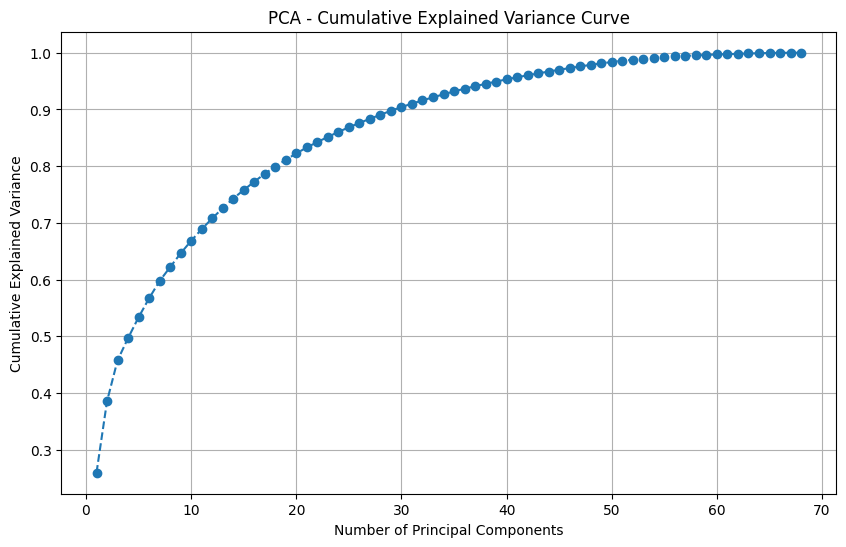
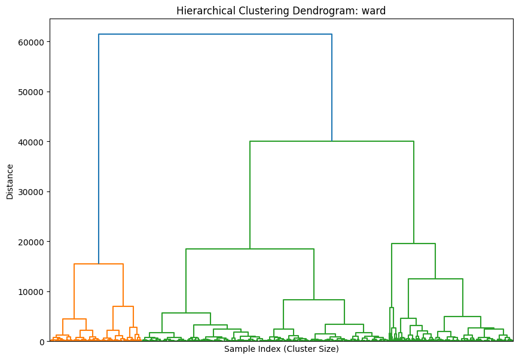
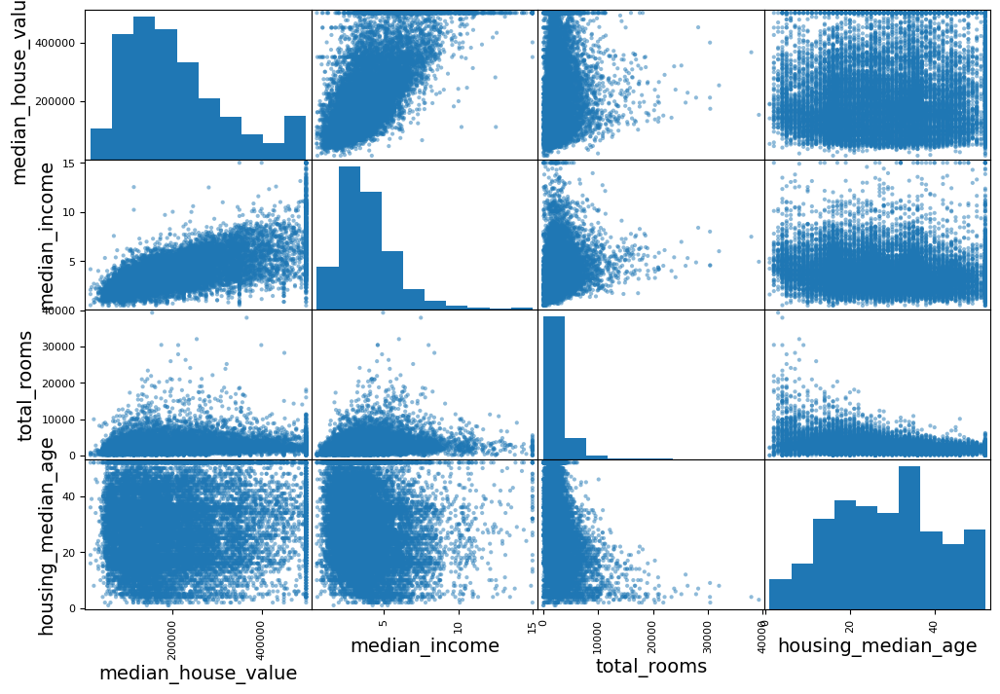

# ML_Audio_ID Project Journal

## Work Log

[work log](https://docs.google.com/spreadsheets/d/1Cv_RgunlO0N1p7FwOmZY59oMYiBCcdY5pVAlBwqEcnM/edit?usp=sharing)

## Week 0

### Data Preparation

- Setup project and git repo
- Compile training data  & write [`utility scripts`](./utilities/) to init development environment, fetch training data from local server
- create script: [`chunk_mp3.py`](./chunk_mp3.py) to chunk training data into 10 second segments starting from the end to the start
  - The last 10 seconds are the most relevant to the classification of the audio tracks; this contains the "outro" music.
- create script: [`classify_mp3.py`](./classify_mp3.py) to allow manual tagging of training data.

### Pre Reading & Notes

#### [*Efficient Label Collection*](./Wigness_Efficient_Label_Collection_2015_CVPR_paper.pdf)

Short paper on creating efficient label sets from untagged data.

#### [*Hands on Machine Learning*]

Consider implementing online learning to allow consistent training of model and avoid model rot.

- What is the good learning rate for this set?

Chapter 9: Unsupervised Learning

- Investigate using k-means to cluster training data using previously tagged tracks.
- What features to pull from audio?

## Week 1

### 3 November, 2024

#### Feature Extraction

Determining which features to extract is challenging. I need to learn about different methods for identifying audio features that can differentiate between spoken content and musical content.

I've moved the feature extraction into a the [audio_features](./audio_features.ipynb) notebook to make it easier to re-use this in a standardized way in the future. I've settled on the following features:

Extract the following audio audio features:

- MFCCs: Mel-Frequency Cepstral Coefficients (13 features)
    - widely used in speech and audio processing; measure the power spectrum and capture tonal and timbral features
- ZCR: Zero-Corssing Rate (1 feature)
    - how often the signal amplitude switches across zero; can be used for identifying harmonic features
- Spectral Contrast: mean of each 7 spectral bands (7 features)
    - measures difference in amplitude across different frequencies; music tends to have richer harmonic structure which is reflected in spectral contrast
- Chroma Features: mean of chroma bins (12 features)
    - intensity of the audio signal in 12 pitch classes common in western music; reflects tonal content common in music, but lacking in dialogue
- RMS Energy: Root Mean Square Energy (1 feature)
    - average power of the audio signal over time also known as "loudness"; speech tends to be more dynamic in this domain
- Spectral Rolloff: (1 feature)
    - frequency below which 85% of total spectral energy is contained; music tends to have a broader frequency range

After extracting features, the PCA variance was checked to try to find a cutoff point for the features. The hope was this would help prevent over fit of the data.


#### K-Means Clustering

Attempted [K-Means Clustering](./kmeans_clustering.ipynb); this yields midling results. A random sampling of tracks from each cluster shows that clusters 0 and 1 are reasonably well classified as tracks containing some musical elements, but at least 1/5 of all checked samples in both groups is contains only dialogue. Cluster 2 similarly is about 80% only dialogue, but after several rounds of random sampling, at least one track in each sample contains music. This is insufficient for the purposes of this project.

#### t-SNE Clustering

I was dissatisfied with K-Means clustering and decided to try t-SNE clustering. I'm not very familiar with how this works or how to tune it. The results of my fiddling can be seen below.

Experimenting with different cluster sizes yields a value of 3 clusters with a silhouette score of 0.16. This is quite low overall. The t-SNE visualization shows some separation of the clusters, but also considerable overlap.


#### DBSCAN Clustering

After unsatisfying clustering results using K-Means, I add additional features:

- Spectral Bandwidth:
    - width of spectral range; music typically has a wider bandwidth
- Spectral Centroid:
    - center of mass in the spectrum and brightness of sound; music typically has a hihger brightness
<!-- - Tempo:
    - rythmic structure -->
- HNR: Harmonic-to-Noise-Ratio
    - speech has more harmonic structure



Based on this graph, I chose to cutoff at 20 components as this contains roughly 80% of the feature data.

Attempted [DBSCAN Clustering](./DBSCAN_clustering.ipynb); this yields very poor results. Everything is classified as "noise". A wide variety of epsilon and neighbor values were tried and no significant results were found. I tried running DBSCAN with a variety of different parameters to try to find a DBSCAN cluster that would yield any significant clustering. 

I primarily varied epsilon over the range of 0.01 to 3 with 30 steps and min_samples over the range 3..9 (inclusive).

Almost all of the samples are identified as noise. Below is a typical clustering output for `eps=0.06157894736842105; min_samples=2`


With my current level of understanding of DBSCAN, this route of clustering data is not worth following any further.

### 4 November, 2024

#### Classification Tool

I need a way to verify the results and to build a labeled set. To help out with that, I built an mp3 player with simple controls that outputs a JSON file with classifications I can use later: [classify_mp3](./classify_mp3.py).

#### Hierarchical Cluster Guided Labeling (HCGL)

This method is based on the *Efficient Label Collection* paper. Testing results can be found in [HGCL Clustering](./clustering_HGCL_testing.ipynb). 

This method was helpful in initially grouping tracks by feature. From here I could create m3u playlists and do some random sampling of the files to verify that the clusters were largely correct. The `ward` and `median` type linkage appears to be the most effective at identifying tracks that are of type "dialogue", "music" and "both".




I ultimately decided to use the `ward` type with a cutoff at 200100 as it has three distinct groupings. One definite group in the orange segment and two similar groups in the green segment. I believe that this represents the "music" (orange) and "dialogue"/"both" (green) categories.

The cutoff at 200100 should preserve those groupings.

Examining the clusters manually shows that orange cluster contains about 67% "Music" and "Both" and the green cluster contains 67% dialogue. This is reasonably helpful, but not good enough to divide the training sets

```Python
play_and_classify_m3u('orange_median.m3u', num_tracks=1)
Classification Ratios:
M: 0.21
D: 0.33
B: 0.46
Music & Both: 67.3076923076923; Dialogue: 32.69230769230769

play_and_classify_m3u('green_median.m3u', num_tracks=1)
Classification Ratios:
M: 0.00
D: 0.67
B: 0.33
Music & Both: 33.33333333333333; Dialogue: 66.66666666666666
```

Using a random forest with labeled data to improve accuracy is the next task. Once the classification has been improved, verifying the quality of the classifier is the next step.

### 5 November, 2024

#### Improved Labeling

Used random forrest classifier to identify tracks with highest uncertainty and manually reclassify. After reclassification, tracks from each cluster were manually verified. Results:

**00_refined_both_playlist.m3u**: 4% of the sampled tracks were misclassified as containing music; the remaining 96% were correct though there were several music only tracks classified as containing both dialogue and music (10%).

```Text
Classification Ratios:
M: 0.10
D: 0.04
B: 0.86
Music & Both: 96.0; Dialogue: 4.0
```

**00_refined_dialogue_playlist.m3u**: 0% of the sampled tracks were misclassified.

```Text
Classification Ratios:
M: 0.00
D: 1.00
B: 0.00
Music & Both: 0.0; Dialogue: 100.0
```

**00_refined_music_playlist.m3u**: 0% of the sampled tracks were misclassified.

```Text
Classification Ratios:
M: 1.00
D: 0.00
B: 0.00
Music & Both: 100.0; Dialogue: 0.0
```

#### Training Data Collection

The playlists generated through the improved labeling step can now be used for training. The training sets are now as follows:

- 00_refined_both_playlist.m3u: 510 items containing music or music and dialogue
  - Estimated 96% accurate
- 00_refined_music_playlist.m3u: 157 items containing exclusively music
  - Estimated ~100% accurate
- 00_refined_dialogue_playlist.m3u: 703 items containing exclusively dialogue
  - Estimated ~100% accurate

The training sets for "music" (including mixed music & dialogue) and exclusive "dialogue" are roughly equal in size.

This training data can now be used to develop and evaluate a the best training scheme for identifying audio clips. An additional corpus of ~30K unlabeled items are available for testing.

### 6 November, 2024

#### Combine various labeled sets

Throughout the experimental phase, more and more of the training data was manually labeled. The manually labeled data can be combined to create an improved classifier. This was challenging because the assumptions and techniques used to create the label sets has evolved over through the development process. A stable label set has now been generated and combined with the extracted features.

The data sets are combined with the [combined_label_data](./combine_labeled_data.ipynb) notebook.

I've realized that most of the classification was not done through clustering, but rather through iteratively labeling data. My clustering attempts were not terribly successful.

#### Develop ensemble classifiers

The ensemble classifier is composed of a random forrest and gradient boosting classifier. The Gradient boosting classifier is weighted more heavily in the soft vote as it is slightly more accurate over all (higher f-1 score). The overall accuracy over the training and sample data is 92% for the ensemble. 

The ensemble classifier can be found in the [classifier_ensemble](./classifier_ensemble.ipynb) notebook.

A manual evaluation of 80 random tracks classified from novel data shows that the classifications were 97.5% accurate for the "Music" and "Both" categories and 97.5% accurate for the "Dialogue" category. This should be acceptable for the purposes of this project.

```text
Unique labels in y: [1 0]
Fitting 3 folds for each of 20 candidates, totalling 60 fits
Random Forest Accuracy after Tuning: 0.90

Random Forest Classification Report:
               precision    recall  f1-score   support

           0       0.93      0.89      0.91        44
           1       0.88      0.92      0.90        39

    accuracy                           0.90        83
   macro avg       0.90      0.90      0.90        83
weighted avg       0.90      0.90      0.90        83

Fitting 3 folds for each of 20 candidates, totalling 60 fits
Gradient Boosting Accuracy after Tuning: 0.92

Gradient Boosting Classification Report:
               precision    recall  f1-score   support

           0       0.93      0.91      0.92        44
           1       0.90      0.92      0.91        39

    accuracy                           0.92        83
   macro avg       0.92      0.92      0.92        83
weighted avg       0.92      0.92      0.92        83

Ensemble Classifier Accuracy after Tuning: 0.92

Classification Report:
               precision    recall  f1-score   support

           0       0.93      0.91      0.92        44
           1       0.90      0.92      0.91        39

    accuracy                           0.92        83
   macro avg       0.92      0.92      0.92        83
weighted avg       0.92      0.92      0.92        83

```

### 7 November, 2024

#### Next steps

I have experimented heavily with different ensemble models. With some guidance from tutorials and Chat GPT, I've fiddled with hyper parameters and have a pretty successful classifier. It is > 95% accurate with novel data.

I know that I've just grazed the surface of this topic and want to better understand how these algorithms work, and see if there are potentially other algorithms that are more effective that I haven't explored. 

To that end, I've decided to work through the first few chapters of *Hands on Machine Learning with Scikit-Learn , Keras & TensorFlow* (*HOML*). I plan to work some of the sample exercises and see if I can gain some insights on what I have tried up to this point and deepen my understanding.  

The rest of this project period will include a summary of my notes, exercises that I complete and any ideas that I have to improve the work that I have done up to this point.

#### Setting up a Python 3.9.17 Environment

*HOML* has an extensive list of python package requirements; some appear to be pinned to versions that are incompatible with Python 3.12. I narrowed down the latest version of python that should work to 3.9.17, but ran into an issue with creating a virtual environment for that project.

There were various python environment snags that took several hours to unwind. This primarily included diagnosing issues with PyEnv, upgrading various system components and eventually culminating in writing a script to manage virtual environments in the future. 

The script will be useful for setting up future Python projects and can be imported as a git submodule. It can be found at [pyenv_utilities](https://github.com/txoof/pyenv_utilities/blob/main/README.md).

#### Chapter 1

Key points: 

- ML is essentially teaching computers by example from data.
- ML really shines for tasks that are complex and are too difficult to define through hand-crafted rules
- Data is king. More data typically produces higher quality models. Data poverty is a real problem and leads to models that behave erratically. There are lots of ways to fudge slim data sets this that work relatively well like using train-dev data sets that are not 100% representative of production data, but "close enough."

#### Chapter 2 - California Housing Project

The ML Project Checklist:

- [ ] 1. Frame the problem and look at the big picture.
- [ ] 2. Get the data.
- [ ] 3. Explore the data to gain insights
- [ ] 4. Prepare the data to better expose the underlying data patterns to machine learning algorithms.
- [ ] 5. Explore many different models and shortlist the best ones.
- [ ] 6. Fine-tune your models and combine them into a great solution.
- [ ] 7. Present your solution.
- [ ] 8. Launch, monitor, and maintain your sy system.

##### Frame The Problem

- **Objective:** predict a district's median housing price in support a downstream ML system that supports investment decisions.
- **Current State:** Prices are currently estimated manually using complex rules. Predictions can be off by up to 30%
- **Data Set:** Census data contains median housing prices for thousands of districts including other data features.
- **Performance Measure:** Suggested RMSE (root mean square error).
- **Assumptions Check:** E.g. will downstream systems use the exact prices, or bin them into categories? Do calculations need to be precise, or "close enough"?

\[
\text{RMSE}(X, h) = \sqrt{\frac{1}{m} \sum_{i=1}^{m} \left(h(x^{(i)}) - {y}^{(i)}\right)^2}
\]
- $m$ is the number of instances of the data set being measured
- $x^{(i)}$ is a vector of all the feature values of the $i^th$ instance in teh data
- $y^{(i)}$ is the label (desired output)
- $X$ is a matrix containing all the feature values (excluding labels); one row per instance and the $i^th$ row is equal to the transpose of $x^{(i)}$
- $h$ is the system prediction function

### 8 November, 2024

For the remaining portion of Chapter 2, all of my work can be found in the [chapter 02 Workbook](./handson_exercises/chapter_02_workbook.ipynb) Jupyter notebook.

#### Chapter 2 Continued

##### Get the Data

Pull the data down as a tarball from github and load into a pandas dataframe.

##### EDA

Take a look at the data and generate some histograms to help with observations

`housing.describe()`:

|       |   longitude |    latitude |   housing_median_age |   total_rooms |   total_bedrooms |   population |   households |   median_income |   median_house_value |
|:------|------------:|------------:|---------------------:|--------------:|-----------------:|-------------:|-------------:|----------------:|---------------------:|
| count | 20640       | 20640       |           20640      |      20640    |        20433     |     20640    |     20640    |     20640       |                20640 |
| mean  |  -119.57    |    35.6319  |              28.6395 |       2635.76 |          537.871 |      1425.48 |       499.54 |         3.87067 |               206856 |
| std   |     2.00353 |     2.13595 |              12.5856 |       2181.62 |          421.385 |      1132.46 |       382.33 |         1.89982 |               115396 |
| min   |  -124.35    |    32.54    |               1      |          2    |            1     |         3    |         1    |         0.4999  |                14999 |
| 25%   |  -121.8     |    33.93    |              18      |       1447.75 |          296     |       787    |       280    |         2.5634  |               119600 |
| 50%   |  -118.49    |    34.26    |              29      |       2127    |          435     |      1166    |       409    |         3.5348  |               179700 |
| 75%   |  -118.01    |    37.71    |              37      |       3148    |          647     |      1725    |       605    |         4.74325 |               264725 |
| max   |  -114.31    |    41.95    |              52      |      39320    |         6445     |     35682    |      6082    |        15.0001  |               500001 |

**Observations**:

- *total_bedrooms* is has rows that are incomplete
- *ocean_proximitiy* is categorical
- *median_house_value* is capped at $500K
- *median_income* is scaled and capped. Values are expressed in units of $10k
- right skew on several features

##### Create a Test Set

Create a test set and hold it in embargo to prevent *data snooping* bias. The best way to do this is to use SciKit's `train_test_split` function. This creates stable sets that are consistent over multiple runs to prevent contaminating the training set with test data and accidentally training the model on test items.

##### Think About Bias

In our problem space, the experts in the downstream forecasting group tell us that median income is very important in predicting median  house prices. *Stratifying* the sample on this might be a good  to ensure that this is captured is captured in the training/test set. Use `pd.cut()` to create a new category that bins median income into five categories.

```Py
housing["income_cat"] = pd.cut(housing["median_income"], 
                               bins=[0., 1.5, 3.0, 4.5, 6., np.inf], 
                               labels=[1, 2, 3, 4, 5])
```

*Stratified sampling* can now be done on these groupings.


SciKit really has you covered. It does it all!

```Py
strat_training_set, strat_test_set = train_test_split(
    housing,
    test_size=0.2,
    stratify=housing["income_cat"],
    random_state=42
)
```

Comparing the stratified test set versus a randomly split test set.

|   Income Category |   Overall % |   Stratified % |   Random % |   Strat. Error % |   Rand. Error % |
|------------------:|------------:|---------------:|-----------:|-----------------:|----------------:|
|                 1 |        3.98 |           4    |       4.24 |             0.36 |            6.45 |
|                 2 |       31.88 |          31.88 |      30.74 |            -0.02 |           -3.59 |
|                 3 |       35.06 |          35.05 |      34.52 |            -0.01 |           -1.53 |
|                 4 |       17.63 |          17.64 |      18.41 |             0.03 |            4.42 |
|                 5 |       11.44 |          11.43 |      12.09 |            -0.08 |            5.63 |

The differences between the randomized and stratified sets are are significant and meaningful in all the categories.

### 11 November, 2024

#### Yet more Chapter 2

##### Explore and Visualize the Data

Fortunately the housing data has Lat/Lon coordinates, so it's trivial to plot them on an XY scatter plot. The population can be mapped to the dot size and the color can be mapped to the price value.


A Pearson Correlation (*r* value) can be calculated for the data as well using the `.corr()` method. These values add depth to the plot. High value houses are highly correlated with median income. So, red dots equal expensive houses for rich people.

|                    |   median_house_value |
|:-------------------|---------------------:|
| median_house_value |            1         |
| median_income      |            0.68838   |
| total_rooms        |            0.137455  |
| housing_median_age |            0.102175  |
| households         |            0.0714265 |
| total_bedrooms     |            0.0546351 |
| population         |           -0.0201529 |
| longitude          |           -0.0508589 |
| latitude           |           -0.139584  |



From the plots, it looks like median_income is the best predictor of value. This matches the table. 


The income cap that the data preparation team pointed out is really apparent making a horizontal cluster at 500k. There are some other fainter horizontal clusters at 450k and maybe just below 300k. I don't know what causes these.

