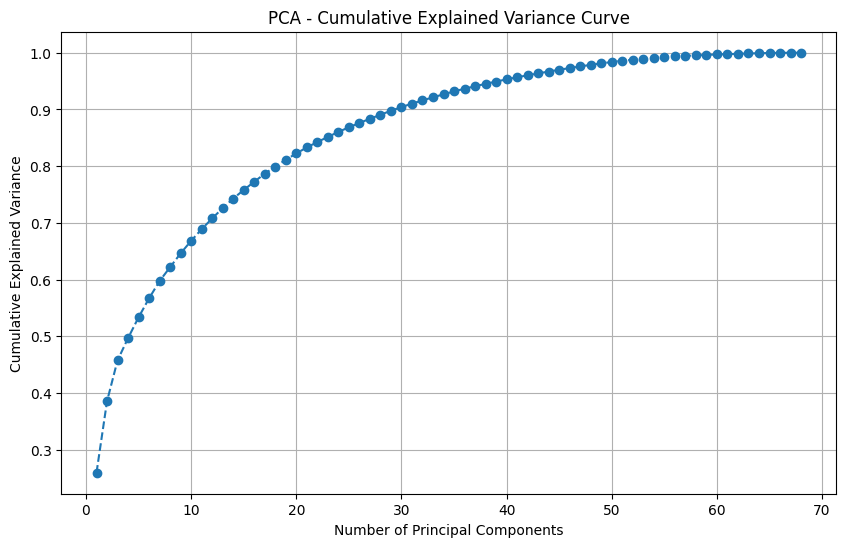
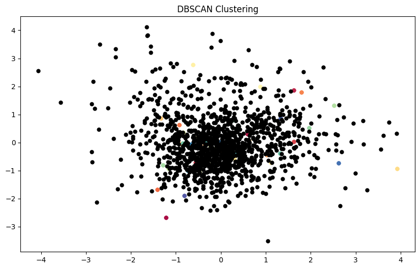
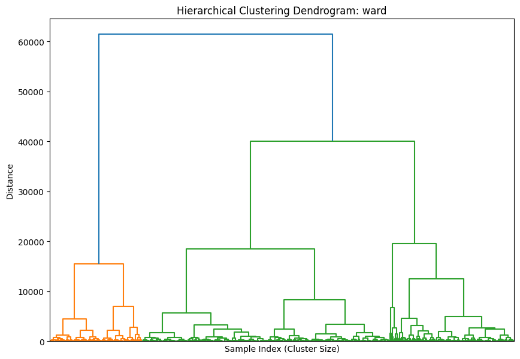

# Final Report: Machine Learning-based Audio Classification Project

## Table of Contents

1. [Project Overview](#project-overview)
2. [Technical Approach](#technical-approach)
3. [Challenges and Solutions](#challenges-and-solutions)
4. [Results and Evaluation](#results-and-evaluation)
5. [Future Work](#future-work)

## Project Overview
This project aimed to develop a machine learning-based system for classifying audio samples into three categories: "Music," "Dialogue," or "Both." The primary objective was twofold: to gain hands-on experience with machine learning techniques and to create a foundation for further analysis of musical content within tracks identified as containing music. Ultimately, the music-containing tracks can be sent to an online identification service for more detailed classification.

## Technical Approach

### Tools and Libraries
The project utilized the following core technologies:
- **Python**: Primary programming language.
- **scikit-learn**: For clustering and classification models.
- **pandas**: For data handling and processing.
- **librosa**: For feature extraction from audio samples.

### Feature Extraction
Audio features were extracted using **librosa**, which provided key audio attributes such as tempo, spectral centroid, zero-crossing rate, and others. These features formed the input dataset for clustering and classification. 

### Clustering and Classification
Several clustering algorithms were explored to group sample data effectively before model training:
**K-means Clustering**: Initially tested, but it did not yield useful clusters for the data.

**DBSCAN**: Similarly ineffective for the dataset.

**Hierarchical Clustering with Ward Linkages (HCGL)**: This method proved effective in creating meaningful clusters and became the final clustering approach. 

**Manual Labeling**: Due to limitations in clustering alone, manual labeling was applied to augment the training data.

For classification, the labeled data was used to train a machine learning model capable of distinguishing between "Music," "Dialogue," and "Both."

## Challenges and Solutions

**Feature Extraction**: Learning and selecting meaningful features from audio samples required significant research and experimentation with **librosa**. Extracting relevant features allowed for a more robust input dataset.

**Clustering Issues**:  Both **k-means** and **DBSCAN** clustering algorithms failed to provide accurate clusters (for further details, see [3 November 2024 Journal Entry](https://github.com/txoof/ml_audio_id/blob/main/Project_Journal.md#3-november-2024) and [4 November 2024 Journal Entry](https://github.com/txoof/ml_audio_id/blob/main/Project_Journal.md#4-november-2024)).

**HCGL Method** using 'ward' linkages, ultimately provided the best results for clustering. While effective, it required a significant amount of manual labeling to create a complete training dataset.

**Manual Labeling**: The reliance on manual labeling introduced time and resource constraints but was necessary for achieving an accurate classification system. 

## Results and Evaluation

### Evaluation

#### Feature Extraction

Feature extraction was quite successful. The features that were ultimately extracted were very useful in eventually training an ensemble classifier that is very effective. Learning how to extract features and explore them through PCA Variance analysis will be useful in the future. I still clearly have a lot to learn about how to evaluate extracted features and I'm just now learning about creating features from extracted features.

See [3 November: Feature Extraction](./Project_Journal.md#3-november-2024) for details.



#### Unsupervised Clustering

The attempt to use unsupervised learning to group and classify the audio tracks was interesting, but yielded poor results. None of the tested method were effective at producing usable groupings. The best results were from k-means classification. This yielded an 80% correct classification, but the requirement for the manual validation of the results showed that this wasn't really a viable option.

Other attempts at using t-SNE and DBSCAN were equally unsatisfying and resulted in either no usable results in the case of DBSCAN and ambiguous results in the case of t-SNE clustering. My lack of knowledge in how to tune these classification systems is likely part of the problem, but also the requirement for manual verification shows that this method is not a logical way to approach this problem.



See [3 November: K-means, t-SNE, DBSCAN](./Project_Journal.md#3-november-2024) for details.

#### Labeling -- Lessons Learned

Throughout the unsupervised training attempts, as I validated the results I stored the labels for later use. I used two different systems for storing labels, one in JSON format and another in CSV. The labels sets contained the same information, but in different formats. One set. stored in JSON, used a shorthand notation that only stored the filename and "B", "D" or "M" for the both, music and dialogue categories respectively. The other, stored in CSV, used the full file path (relative to the project root) and the full classification (Both, Music, Dialogue).

Combining these into a usable labeled set turned out to be a massive hurdle. The lesson learned was to develop a solid plan for storing data before beginning a project like this.

See [4 November](./Project_Journal.md#4-november-2024) for details.

#### Hierarchical Cluster Guided Labeling

This approach was suggested by a friend that works in ML and provided the paper [Efficient Label Collection](./Wigness_Efficient_Label_Collection_2015_CVPR_paper.pdf). It proved to be initially promising and was relatively effective at finding clusters within the data. Unfortunately the results were middling and even worse than K-Means. This produced at best a 66% success rate and requited a lot of manual verification.

See See [4 November, HCGL](./Project_Journal.md#4-november-2024) for details.



```Python
play_and_classify_m3u('orange_median.m3u', num_tracks=1)
Classification Ratios:
M: 0.21
D: 0.33
B: 0.46
Music & Both: 67.3076923076923; Dialogue: 32.69230769230769

play_and_classify_m3u('green_median.m3u', num_tracks=1)
Classification Ratios:
M: 0.00
D: 0.67
B: 0.33
Music & Both: 33.33333333333333; Dialogue: 66.66666666666666
```

#### Ensemble Classification

Based on chapter 7, Ensemble Learning and Random Forrests of *HOML*, I decided to attempt to try creating some ensemble classifiers using tagged data. I chose to use Gradient Boost and Random Forest primarily because those are well covered in chapter 7 and I could find lots of information on using and tuning them.

I built the classifiers and tried several different hyperparameter tuning methods suggested by chat GPT. The results of the final ensemble method were quite good, but relied on a lot of manual labeling.

The F1 Scores of the classifiers and the final ensemble was around 91%.

```text
Unique labels in y: [1 0]
Fitting 3 folds for each of 20 candidates, totalling 60 fits
Random Forest Accuracy after Tuning: 0.90

Random Forest Classification Report:
               precision    recall  f1-score   support

           0       0.93      0.89      0.91        44
           1       0.88      0.92      0.90        39

    accuracy                           0.90        83
   macro avg       0.90      0.90      0.90        83
weighted avg       0.90      0.90      0.90        83

Fitting 3 folds for each of 20 candidates, totalling 60 fits
Gradient Boosting Accuracy after Tuning: 0.92

Gradient Boosting Classification Report:
               precision    recall  f1-score   support

           0       0.93      0.91      0.92        44
           1       0.90      0.92      0.91        39

    accuracy                           0.92        83
   macro avg       0.92      0.92      0.92        83
weighted avg       0.92      0.92      0.92        83

Ensemble Classifier Accuracy after Tuning: 0.92

Classification Report:
               precision    recall  f1-score   support

           0       0.93      0.91      0.92        44
           1       0.90      0.92      0.91        39

    accuracy                           0.92        83
   macro avg       0.92      0.92      0.92        83
weighted avg       0.92      0.92      0.92        83

```

A manual evaluation of 80 random tracks classified from novel data shows that the classifications were 97.5% accurate for the "Music" and "Both" categories and 97.5% accurate for the "Dialogue" category. This should be acceptable for the purposes of this project.

## Next Steps

As I have reached my goal of evaluating the performance of different algorithms, I have decided to work through the first several chapters of *HOML* to deepen my understanding of the field and try to apply that learning to the work I have already done.

## Future Work

To expand upon this project, the following next steps are recommended:

1. **Pipeline Development**: Create a classification pipeline capable of **online training** to adapt to new audio samples continuously.
2. **Enhanced Evaluation Metrics**: Incorporate automated evaluation metrics to reduce reliance on manual validation and streamline future testing.
